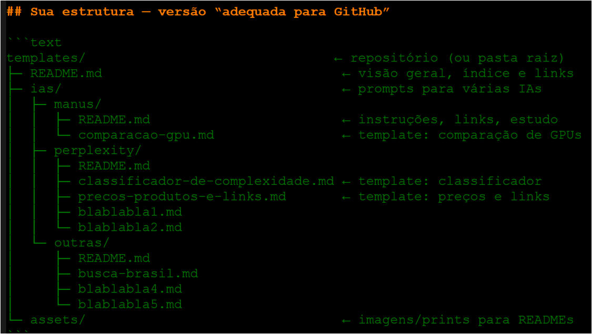

# Local: **templates/mini-instrucoes/README.md**


---

# 📚 Mini-Instrucoes:

* **Mini-Instruçoes** = “como fazer …" - com passo-a-passo prático.
* **Instruções** relativas a processos internos (ex.: criar pastas | renomear arquivo/pastas ...)
* **O que entra aqui:** passo-a-passo de tarefas (como fazer).
* **Sem espaços, acentos ou maiúsculas** em nomes de pastas/arquivos.
* **Prefira `kebab-case`** (`perplexity`, `classificador-de-complexidade.md`).
* **Use uma pasta única para imagens**

* **Ex:**
  ```
  
  
  Explicando Linha de Comando:
  * "!" = Sempre no Inicio.
  * "[]" = Usado com inf sobre a imagem, mas pode ficar "[]".
  * "()" = Caminho aonde a Imagem.
  ```

---

### **Exemplos de nomes prontos:**

* `info-util-0-b-0-botao-como-usar-show-diff.md` — usar o botão Show Diff num PR/commit
* `info-util-0-p-0-pastas-criar-mover-arquivo.md` — criar pasta e mover arquivo no GitHub Web
* `info-util-0-p-0-pastas-renomear-arquivos.md` — renomear arquivos/paths no GitHub Web
* `info-util-0-l-0-links-criar-raw-e-permalink.md` — gerar links Raw e “permalink”
* `info-util-0-l-0-links-cruzar-docs-relativos.md` — cruzar docs via links relativos


---

## Procurar e Revisar Rápido

* Na barra de busca do repositório, pesquise por:
  `repo:epmeloia/templates mini-Instrucoes/ info-util-`
* Para conferir alterações antes de salvar, use **Show Diff / Preview changes**.


---

## Previa de Arquivos:

- Botões:
  * `info-util-0-b-0-botao-add-file.md`
  * `info-util-0-b-0-botao-commit-changes.md`
  * `info-util-0-b-0-botao-create-new-file.md`
  * `info-util-0-b-0-botao-delete-this-file.md`
  * `info-util-0-b-0-botao-edit-lapis.md`
  * `info-util-0-b-0-botao-raw.md`
  * `info-util-0-b-0-botao-show-diff.md`
  * `info-util-0-b-0-botao-upload-files.md`

- Itens:
  * `info-util-0-i-0-itens-branch-e-abrir-pr.md`
  * `info-util-0-i-0-itens-dco-sign-off.md`
  * `info-util-0-i-0-itens-excluir-repositorio.md` *(Danger Zone)*
  * `info-util-0-i-0-itens-fixar-repo-no-perfil.md` *(Pinned repos)*
  * `info-util-0-i-0-itens-preencher-about-topics.md` *(Description/Website/Topics)*
  * `info-util-0-i-0-itens-renomear-repositorio.md`
  * `info-util-0-i-0-itens-template-repository.md`
  * `info-util-0-l-0-links-atualizar-apos-renomear.md`
  * `info-util-0-l-0-links-bookmarklet-raw.md`
  * `info-util-0-l-0-links-buscar-no-repo-e-filtrar.md`
  * `info-util-0-l-0-links-cruzar-docs-relativos.md` *(cruzar docs via links relativos)*
  * `info-util-0-l-0-links-inks-relativos.md`
  * `info-util-0-l-0-links-plain-param.md`
  * `info-util-0-l-0-links-raw-e-permalink.md`

- Meta:
  * `info-util-0-m-0-meta-checklist-commit-mensagem.md`
  * `info-util-0-m-0-meta-checklist-pr-antes-do-merge.md`

- Pastas:
  * `info-util-0-p-0-pastas-assets-e-inserir-imagem-readme.md`
  * `info-util-0-p-0-pastas-mover-arquivo.md`
  * `info-util-0-p-0-pastas-renomear-arquivos.md`
  * `info-util-0-p-0-pastas-subpasta-e-readme-indice.md`


---
