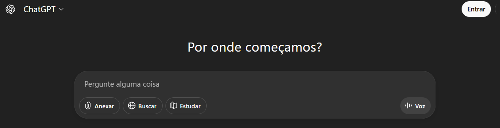

# README:
"README.md"

---

# **MEMEX — Prompts e Utilitários**

---

## **Site:**
'''
[https://memex.tech/](https://memex.tech/)
'''

---
## **Como Usar:**


---
## **Barra da Página Inicial:**



---

# 📚 Mini-Instrucoes:

* **Mini-Instruções** = “como fazer …" - com passo-a-passo prático.
* **O que entra aqui:** passo-a-passo de tarefas (como fazer).
* **Instruções** relativas a processos Internos ou Externos


##----------####----------####----------####----------##
```
         .' '.    .' '.         ,-.
.        .   .    .   .         \ /
 .         .        .       . -{|||)<
   ' .  . ' ' .  . ' ' . . '    / \
                                `-^
```
##----------####----------####----------####----------##