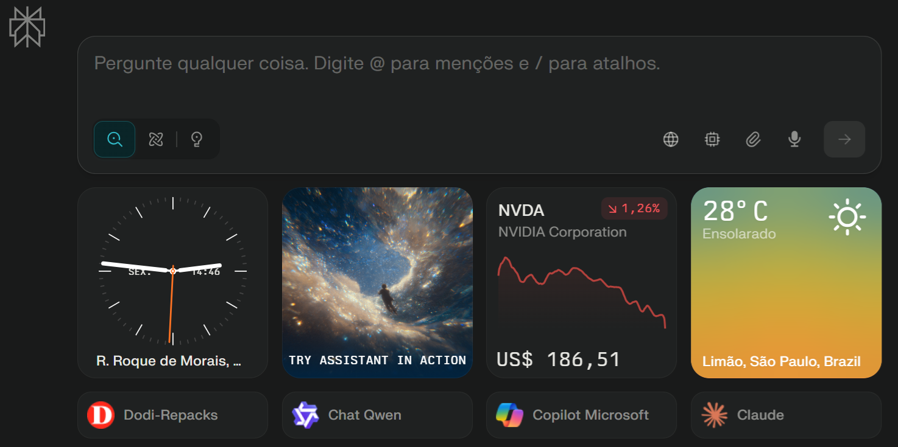

# Perplexity — Templates
## Prompts e utilitários para usar no Perplexity Pro.

---

# Barra da Página Inicial

---

## Site
'''
https://www.perplexity.ai
'''

---

---

## Como usar
1) Abra o template desejado.
2) Clique em **Raw** para copiar o texto puro.
3) Cole no Perplexity antes da pergunta.

---

## Arquivos
- `classificador-de-complexidade.md` — Decide 🟢/🟡/🔴 e quando ativar busca.
- `precos-produtos-e-links.md` — Pesquisa de preços e fontes (em breve).

---

## **Dica prática para lembrar:**

- 🟢 = **💡 Laboratórios**
- 🟡 = **🔍 Buscar** (sem links, peça “sem fontes”)
- 🔴 = **🔀 Pesquisa** (com busca web)

---
