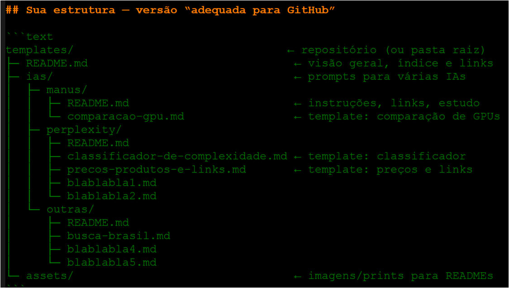

# Com base na neste chat, pegue todas e quaisquer perguntas ou duvidas que tive até agora e gere uma lista os nomes dos possíveis arquivos a serem criados, utilizando o padrão já estabelecido, crie em ordem alfabética, dentro das devidas pastas, como por exemplo:

---

## 1) `templates/mini-glosssarios/`

### *(“o que é / para que serve” — conceitos e peças da UI)*

* `botao-add-file.md`
* `botao-commit-changes.md`
* `botao-create-new-file.md`
* `botao-delete-this-file.md`
* `botao-edit-lapis.md`
* `botao-raw.md`
* `botao-show-diff.md`
* `botao-upload-files.md`
* `itens-branch.md`
* `itens-commit.md`
* `itens-diff.md`
* `itens-fork.md`
* `itens-pull-request.md`
* `itens-repo-about.md` *(“About/Description/Website/Topics”)*
* `itens-template-repository.md`
* `itens-dco-sign-off.md`
* `itens-redirect-apos-renomear.md` *(redirecionos após renomear repo)*
* `links-blob-main-significado.md` *(o que é `/blob/main/`)*
* `links-bookmarklet-converter-raw.md`
* `links-plain-param.md` *(uso do `?plain=1`)*
* `links-raw-githubusercontent.md`
* `links-relativos.md`
* `links-raw-vs-blob.md`
* `links-busca-no-repo.md` *(`repo:<user>/<repo>` / “In this repository”)*
* `links-atualizar-apos-renomear.md` *(estratégia e impactos)*
* `meta-checklist-commit-diff.md`
* `meta-convencoes-nomeacao.md` *(kebab-case, números, sem acentos)*
* `meta-estrutura-repositorio-templates.md` *(pastas/índices)*
* `meta-links-rapidos-readme.md` *(seção de “Links rápidos”)*
* `pastas-criar.md` *(conceito/organização de pastas)*
* `pastas-criar-assets-e-upload.md` *(conceito e porquês)*
* `pastas-criar-subpasta-e-readme-indice.md` *(conceito do índice por pasta)*
* `pastas-mover-arquivo.md` *(conceito de mover via editar caminho)*
* `pastas-renomear-arquivo.md`

---

