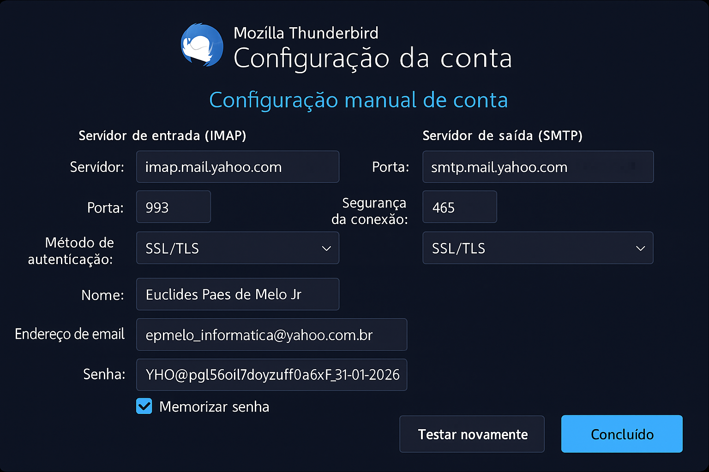

# 🛠 Yahoo Mail + Thunderbird Docs

Welcome to the documentation for securely configuring Yahoo Mail in Thunderbird.

## 📘 Available Checklists

- ✅ [Setup in Portuguese (PT-BR)](../Checklist_Yahoo_Thunderbird_2025.md)
- 🌍 [Setup in English (EN)](../Checklist_Yahoo_Thunderbird_2025_EN.md)

## 📷 Visual Overview

## 🧩 Why this exists?

Yahoo Mail with `@yahoo.com.br` has known compatibility issues with OAuth2. This guide uses app passwords to ensure lasting IMAP functionality.

> _Last sync: November 2025_